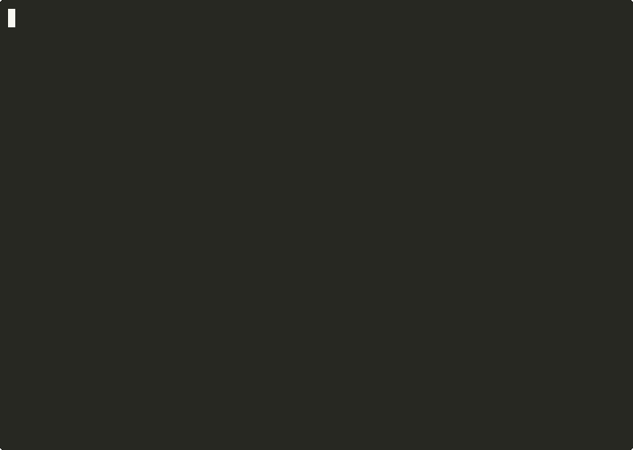

# ANE Training — Stories110M on Apple Neural Engine

Training a 109M-parameter Llama2-architecture transformer (Stories110M) directly on Apple's Neural Engine using private ANE APIs.



## Architecture

- **Model**: Stories110M — dim=768, hidden=2048, heads=12, layers=12, vocab=32000, seq=256
- **109.53M params** (84.95M transformer + 24.58M embedding)
- **72 ANE kernels** per compile (60 weight-bearing, 12 weight-free sdpaBwd2)
- **6 kernel types per layer**: fwdAttn, fwdFFN, ffnBwd, sdpaBwd1, sdpaBwd2, qkvBwd

## Performance

| Component | Time (ms/step) |
|-----------|---------------|
| ANE eval | 9.6 |
| IO (fp16 conversion) | 4.1 |
| Classifier (cblas) | 9.1 |
| Cross-entropy + residuals | 14.4 |
| RMSNorm | 0.1 |
| **Total** | **107 ms/step** |

## Files

| File | Description |
|------|-------------|
| `train_large.m` | Main training loop — 12-layer forward/backward, checkpoint, exec() restart |
| `stories_config.h` | Model config, structs, alloc helpers |
| `stories_io.h` | IOSurface I/O, NEON fp16 conversion, kernel compile/eval |
| `stories_mil.h` | MIL program generators for all 6 ANE kernel types |
| `stories_cpu_ops.h` | vDSP-vectorized RMSNorm, cross-entropy, Adam, embedding ops |
| `dashboard.py` | TUI dashboard — loss curve, power/CPU/memory graphs, text generation |
| `tokenize.py` | Extract pretokenized TinyStories data |
| `Makefile` | Build targets |

## How it works

1. **Forward pass**: Each layer runs fwdAttn (QKV + SDPA + Wo) and fwdFFN (W1 + SiLU(W3) + W2) on ANE via MIL-compiled kernels. Final RMSNorm + classifier matmul on CPU (cblas).

2. **Backward pass**: Reverse layer order. ffnBwd, sdpaBwd1, sdpaBwd2, qkvBwd on ANE. Weight gradients (dW) via async cblas_sgemm on CPU. RMSNorm backward via vDSP.

3. **Compile budget**: ANE has a ~119 compile limit per process. With 72 kernels per batch, we run 10 accumulation steps then `exec()` restart with checkpoint resume.

4. **Data**: Real TinyStories text (20M tokens), mmap'd uint16 token IDs, random position sampling per step.

## Usage

```bash
# Extract tokenized data
python3 tokenize.py

# Build and train
make train_large
./train_large                    # fresh start
./train_large --resume           # resume from checkpoint

# Monitor with dashboard
pip install blessed psutil numpy
python3 dashboard.py --resume    # needs sudo for powermetrics
```

## Key techniques

- **NEON vectorized fp16<->fp32**: ARM NEON intrinsics for fast IOSurface data transfer
- **vDSP cross-entropy**: `vDSP_mtrans` + `vvexpf` + `vDSP_sve` — 8x faster than scalar
- **Async weight gradients**: cblas_sgemm dispatched to background queue, overlapped with ANE
- **SDPA causal mask workaround**: ANE hardware ignores attn_mask, so we decompose attention into Q@K^T (ANE conv) + mask+softmax (CPU) + scores@V (ANE conv)
